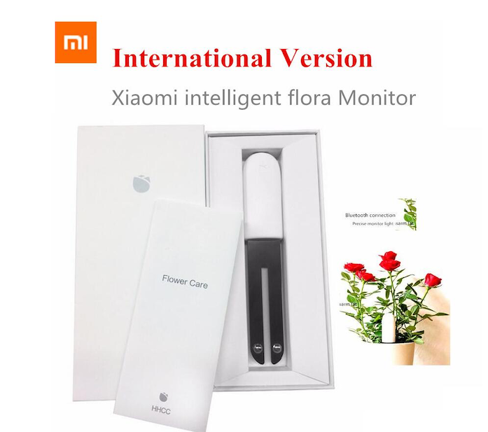

# Smartgrow Control System

Dieses [PlatformIO](https://platformio.org) Projekt basiert auf dem [miflora-esp32](https://github.com/RaymondMouthaan/miflora-esp32) Projekt von [@RaymondMouthaan](https://github.com/RaymondMouthaan). 

Der ESP32 Controller bezieht Sollwerte für die System vorhandenen Pflanzen, sowie die Mac Adressen der Xiaomi MiFlora Sensoren über MQTT vom [Server](https://github.com/Der-Erzfeind/SmartGrow/tree/main/RaspberryPI). Anschließend werden die Sensoren ausgelesen und bei Bedarf Kommandos zum Ansteuern der Pumpen an den Arduino Nano gesendet. Abschließend werden die Messdaten über MQTT zurück an der Server gesendet.



## Features

Das Basisprojekt von @RaymondMouthaan wurde wie folgt verändert:

- Dynamische Zuweisung der Elemente der Elemente der Sensor Klasse
- Bezug der Parameter der Sensor Klasse vom Server über MQTT
- callback() Funktion zum Parsen der erhaltenen Parameter hinzugefügt
- MQTT Topics für Kommunikation mit Server geändert und Telegramme angepasst
- Klasse Box mit Elementen für Füllstände hinzugefügt
- control.cpp mit Funktionen zum Ansteuern der Pumpen und Sensoren hinzugefügt
- control.h mit Definitionen der Sensor Pins und UART Commands
- statische IP-Adressen Zuweisung für Verbindung mit Hotspot des Raspberry PI

__Beachte : Projekt befindet sich im Prototyp Stadium, es können Fehler auftreten. Weitere Features, wie eine Notfallabschaltung und Fehlerbehandlung werden noch hinzugefügt__

## Technische Voraussetzungen

Hardware:
- ESP32 ([ESP32 auf AliExpress](https://nl.aliexpress.com/wholesale?catId=0&initiative_id=SB_20200408062838&SearchText=MH-ET+Live+ESP32))
- Xiaomi Flora Plant Sensor (firmware revision >= 2.6.6) ([Xiaomi flora auf AliExpress](https://nl.aliexpress.com/wholesale?catId=0&initiative_id=SB_20200408063038&SearchText=xiaomi+flora))

Software:
- MQTT broker (z.B. [Mosquitto](https://mosquitto.org))

## Benutzungsanleitung

Es werden Kenntnisse in der Nutzung von [Visual Studo Code](https://code.visualstudio.com) und [PlatformIO](https://platformio.org) angenommen. 

1) Öffnen Sie das Projekt in Visual Studio Code mit PlatformIO installiert.
2) Kopieren Sie `example/config.h.example` nach `include/config.h` und passen Sie folgende Einstellungen für Ihr Netzwerk an:
    - WLAN Settings
    - MQTT Settings
3) passen Sie platform.ini für Ihre Geräte an:
    - upload_port
    - monitor_port

## Mess- und Regelungszyklus

The ESP32 will perform a single connection attempt to the Xiaomi Mi Plant sensor, read the sensor data & push it to the MQTT server. The ESP32 will enter deep sleep mode after all sensors have been read and sleep for n minutes before repeating the exercise...
Battery level is read every nth wakeup.
Up to n attempst per sensor are performed when reading the data fails.

## Configuration

- `SLEEP_DURATION` - how long should the device sleep between sensor reads?
- `EMERGENCY_HIBERNATE` - how long after wakeup should the device forcefully go to sleep (e.g. when something gets stuck)?
- `BATTERY_INTERVAL` - how often should the battery status be read?
- `BATTERY_THRESHOLD` - when is the battery on low power?
- `SENSOR_RETRY` - how ofter should a single sensor be tried on each run?

## Topics

The ESP32 will publish payload in json format on two base topics and are divided in two categories:

### Device topic

This topic is used to publish payload related to the esp32 device status and lwt (last will and testament).

#### Last will and testament

When the ESP32 connects to the MQTT broker a `online` message will be published to the `/device/lwt` subtopic to indicate the ESP32 is online.

Topic format: `<base_topic>/<device_id>/device/lwt`

Example plain text payload:
```
online
```

When the ESP32 disconnects from the MQTT broker an `offline` message is published to the `/device/lwt` subtopic to indicate the ESP32 is offline and in sleep mode.

Example plain text payload:
```
offline
```


### Sensor topic

This topic is used to publish payload related to the Miflora sensor measurements. Each Miflora sensor has its own subtopic. 

Topic format: `<base_topic>/<device_id>/sensor/<location>/<plant_id>`

Example json payload:
```
{
    "id": "calathea-1",
    "location": "livingroom",
    "mac": "C4:7C:8D:67:57:07",
    "retryCount": 1,
    "rssi": -75,
    "temperature": 21.2,
    "temperatureLevel": 1,
    "moisture": 4,
    "moistureLevel": 0,
    "light": 1203,
    "lightLevel": 1,
    "conductivity": 72,
    "conductivityLevel": 0,
    "battery": 98,
    "batteryLow": false,
    "batteryLevel": 2
}
```

- `id` - the id of the plant
- `location` - the location where the Miflora is placed
- `mac` - the MAC address of the Miflora
- `retryCount` - number of retry attempts to retreive valid data from the Miflora
- `rssi` - the BLE Received Signal Strength Indicator
- `temperature` - the measured temperature in degree Celsius
- `temperatureLevel` - indicates if the temperature is 0=low, 1=medium or 2=high, configurable by minTemperature and maxTemperature
- `moisture` - the measured moisture in percentage
- `moistureLevel` - indicates if the moisture is 0=low, 1=medium or 2=high, configurable by minMoisture and maxMoisture
- `light` - the measured light in lux
- `lightLevel` - indicates if the light is 0=low, 1=medium or 2=high, configurable by minLight and maxLight
- `conductivity` - the measured conductivity in uS/cm
- `conductivityLevel` - indicates if the conductivity is 0=low, 1=medium or 2=high, configurable by minConductivity and maxConductivity
- `battery` - the measured battery level in percentage
- `batteryLow` - indicates if the battery is low (true or false), based on the battery low threshold
- `batteryLevel` - indicates if the battery is 0=low, 1=medium or 2=high, based on the battery low and mediun thresholds

__Note: the min and max values for each measurement can be found in the Flower Care app for [IOS](https://apps.apple.com/us/app/flower-care/id1095274672)__ or [Android](https://play.google.com/store/apps/details?id=com.huahuacaocao.flowercare&hl=en).

## Constraints

Some "nice to have" features are not yet implemented or cannot be implemented:
  - OTA updates: I didn't manage to implement OTA update capabilities due to program size constraints: BLE and WLAN brings the sketch up to 90% of the size limit, so I decided to use the remaining 10% for something more useful than OTA...

## Sketch size issues

The sketch does not fit into the default arduino parition size of around 1.3MB. You'll need to change your default parition table and increase maximum build size to at least 1.6MB.
On Arduino IDE this can be achieved using "Tools -> Partition Scheme -> No OTA". 
For this platform.io project this is achieved using `board_build.partitions = no_ota.csv` in `platformio.ini`.

## Credits
Many thanks go to @sidddy and @jvyoralek for most of the work of the project and improvements!
Many thanks go to the guys at https://github.com/open-homeautomation/miflora for figuring out the sensor protocol.
